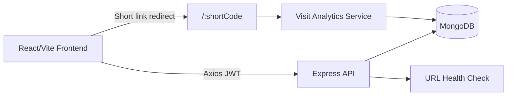
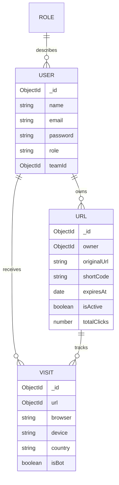

# LinkFlow Pro

LinkFlow Pro is a full stack SaaS URL shortener built with React 19, Vite, Tailwind CSS, Express, MongoDB, Mongoose, JWT, and bcrypt. It supports custom aliases, QR codes, expiry, password-protected links, public stats, bot separation, CSV import/export, role-based access, admin oversight, and deployment-ready configuration for Vercel and Render.


### youtube Link
https://youtu.be/y_H_WAPkeYw

## Features

- JWT authentication with bcrypt password hashing
- Roles: admin, manager, user
- Create, edit, delete, star, search, filter, and health-check short links
- Custom aliases such as `/sale2026` and `/offer`
- Expiry handling with the exact expired response: `This link has expired`
- Click analytics: timestamp, browser, device, OS, country, city, referrer, fraud score, human vs bot
- Recharts analytics dashboard and public `/stats/:shortCode` page
- QR code generation and PNG download
- Bulk CSV URL shortening and analytics CSV export
- Helmet, CORS, input sanitization, validation, rate limiting
- Docker, GitHub Actions, Vercel frontend, Render backend

## Architecture Diagram



## ER Diagram



## Setup

1. Install Node.js 20+ and MongoDB.
2. Copy env files:
   - `backend/.env.example` to `backend/.env`
   - `frontend/.env.example` to `frontend/.env`
3. Install dependencies:

```bash
npm install
```

4. Seed demo data:

```bash
npm run seed
```

5. Run backend and frontend in separate terminals:

```bash
npm run dev:backend
npm run dev:frontend
```

Demo users seeded with password `Password123!`:

- `admin@linkflow.dev`
- `manager@linkflow.dev`
- `user@linkflow.dev`

## Environment Variables

Backend:

```env
NODE_ENV=production
PORT=5000
MONGO_URI=mongodb+srv://...
JWT_SECRET=long_random_secret
JWT_EXPIRES_IN=7d
CLIENT_URL=https://your-vercel-app.vercel.app
SHORT_URL_BASE=https://your-render-api.onrender.com
BCRYPT_SALT_ROUNDS=12
RATE_LIMIT_WINDOW_MS=900000
RATE_LIMIT_MAX=250
```

Frontend:

```env
VITE_API_BASE_URL=https://your-render-api.onrender.com/api
VITE_SHORT_URL_BASE=https://your-render-api.onrender.com
```

## API Documentation

Auth:

- `POST /api/auth/register` `{ name, email, password }`
- `POST /api/auth/login` `{ email, password }`
- `GET /api/auth/me`
- `POST /api/auth/logout`

URLs:

- `GET /api/urls?search=&status=&starred=`
- `POST /api/urls` `{ originalUrl, customAlias, expiresAt, password, isPublicStatsEnabled }`
- `PATCH /api/urls/:id`
- `DELETE /api/urls/:id`
- `POST /api/urls/bulk` `{ csv }`
- `POST /api/urls/:id/health`
- `GET /api/urls/:id/export`
- `GET /:shortCode`

Analytics:

- `GET /api/analytics/:id`
- `GET /api/public/stats/:shortCode`

Admin:

- `GET /api/admin/overview`
- `GET /api/admin/users`
- `PATCH /api/admin/users/:id/role`

## Deployment Guide

Render backend:

1. Create a new Web Service from this repo.
2. Root directory: `backend`
3. Build command: `npm install`
4. Start command: `npm start`
5. Add backend environment variables.

Vercel frontend:

1. Import the repo in Vercel.
2. Root directory: `frontend`
3. Build command: `npm run build`
4. Output directory: `dist`
5. Add frontend environment variables.

Docker:

```bash
docker compose up --build
```

## Sample Screenshots Section

Add screenshots for:

- Landing page
- Dashboard link table
- Analytics dashboard
- Admin panel
- Mobile dashboard

## AI Planning Document

Implementation plan:

1. Define MongoDB models for users, roles, URLs, and visits.
2. Build JWT auth, RBAC, validation, rate limiting, and security middleware.
3. Implement URL lifecycle APIs and redirect tracking.
4. Add analytics aggregation for charts and CSV export.
5. Build React pages with protected routing, dashboard CRUD, QR download, and public stats.
6. Add deployment, Docker, CI, seed data, and documentation.

## Assumptions

- Public short links are served by the backend domain configured in `SHORT_URL_BASE`.
- Geo data is inferred from deployment headers such as Cloudflare or Vercel; unknown values are stored when unavailable.
- Password-protected links accept a `?password=` query for redirects; a production UI can add a branded password entry page.
- Manager team ownership uses `teamId`; each manager can own a team namespace.

## Future Improvements

- Add refresh tokens and server-side token revocation.
- Add scheduled health checks and email alerts.
- Add workspace billing and usage limits.
- Add advanced IP reputation integrations for fraud scoring.
- Add Playwright end-to-end tests and API integration tests.

## Video Demonstration

This project is a part of a hackathon run by https://katomaran.com
